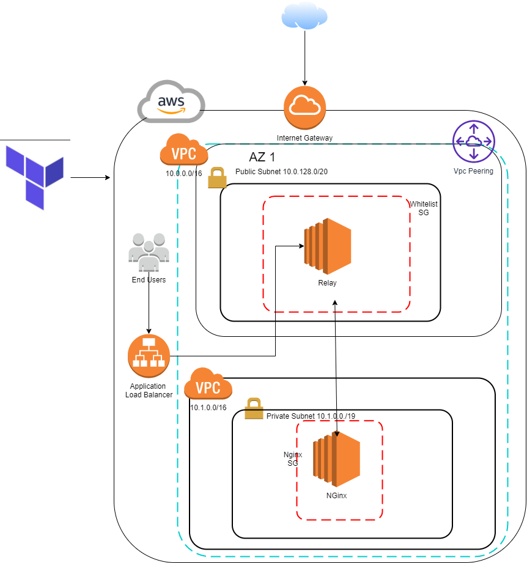

## Requirement
* AWS Free Tier Account 
* Jenkins
* Terraform => v0.12
* For Terratest --> Go v0.13

### Constrains
* Replace key_name with your current pem
* Replace public key with the public key of your Pem for the Remote Provisioner.
* Replace Route 53 Zone ID
* Replace Domain Name with your current domain
* Replace SSL arn with current 

## Improvement tbd
* S3 Backend with State Lock

## AWS Architecture


## Jenkins Automation


## Terratest
```
------------------------------------------------------------------------

```